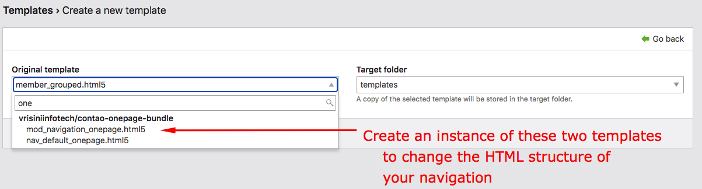

<h1 align="center">Convert a Contao multipage website to onepage without any code.</h1>

    
    
    

 

### Supports
- Contao 4.4.x and above
- We deliberately kept it to 4.4 because there might still be several older websites who want to have a one page theme on their existing website.

### Features
- This can render the <b>main articles</b> of all pages and their subpages!
- Renders page articles at 'n-th' level of site-structure.
- No template integration required.
- No additional JS required.
- No configuration required.

### Installation
- Use Contao-Manager for installation of this bundle
- Alternately, you can download this bundle and manually install at your own risk.

### Pre-requisite
jQuery is required for the navigation smooth scrolling. 
Hence, please include jQuery to your layout as shown below

### Navigation templates

 

### Support & Maintenance
This is a continuous work in progress. We cannot guarantee perfect rendering. If you have any issues, please feel free to contact us. Your feedback is important to us!
